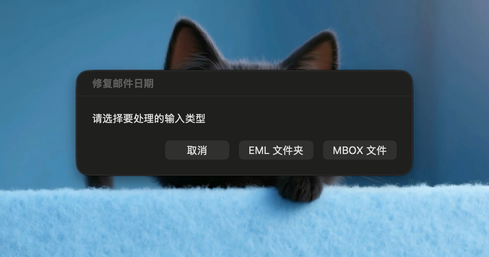
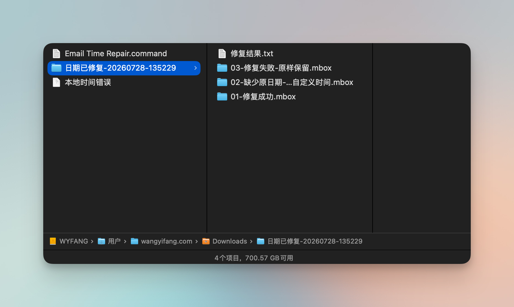

# Email Time Repair

A local macOS utility for repairing incorrect future dates in Thunderbird
mail exports. It restores message dates from `X-MailStore-Date`, handles
legacy Chinese headers, and writes categorized MBOX files ready to import.

一个在 macOS 本地运行的 Thunderbird 邮件日期修复工具。适用于邮件日期被错误
显示为 2101 年等未来时间、导致正常邮件长期排在后面的情况。

> The original mail export is never modified. Back it up before processing
> and verify the results before deleting anything.

## 功能

- 支持整个 MBOX 文件，也支持包含 `.eml` 邮件的文件夹。
- 从 `X-MailStore-Date: YYYYMMDDhhmmss` 恢复标准 `Date` 邮件头。
- 同步修复 MBOX 的内部日期，避免 Thunderbird 使用导入当天的时间。
- 修复部分旧邮件中未经 MIME 编码的 UTF-8、GBK/GB18030 中文发件人和主题。
- 缺少 `X-MailStore-Date` 时，可为这些邮件统一设置一个自定义时间。
- 不修改输入文件，结果写入新的时间戳文件夹。
- 完全在本机处理，不上传邮件，也不需要网络连接。

## 系统要求

- macOS
- Thunderbird
- Python 3（当前版本的 macOS 通常已提供 `/usr/bin/python3`）
- 推荐安装 Thunderbird 扩展
  [ImportExportTools NG](https://addons.thunderbird.net/thunderbird/addon/importexporttools-ng/)

## 下载与首次运行

1. 下载本仓库的 ZIP 并解压。
2. 找到 `Email Time Repair.command`。
3. 第一次运行时，按住 Control 点击文件，选择“打开”。
4. 如果系统提示文件不能执行，可在“终端”中运行：

   ```zsh
   chmod +x "/你的路径/Email Time Repair.command"
   ```

## 使用方法

### 1. 先检查 Thunderbird 的保留设置

导入旧日期邮件前，请在 Thunderbird 的“本地文件夹”设置中确认：

**磁盘空间 → 不要删除任何消息**

如果设置成“自动删除超过 7 天的邮件”，修复后的旧邮件可能刚导入就被自动删除，
看起来像是 MBOX 为空。

### 2. 导出邮件

推荐把需要修复的整个邮件文件夹导出为一个 MBOX 文件，这样不需要在
Thunderbird 中选中数千封邮件。

也可以导出为 EML。若使用 ImportExportTools NG 导出 EML，请选择旧版的
**“消息（嵌入附件）”**，不要选择带有 **“(v15)”** 的格式；部分旧中文邮件使用
v15 格式导出后可能已经变成 `�`，这种字符损坏无法由本工具还原。

### 3. 运行工具

双击 `Email Time Repair.command`，然后选择输入类型：



1. 推荐选择“**MBOX 文件**”，再选择刚导出的 MBOX。
2. 输入缺少原始日期的邮件要统一使用的时间，格式为：

   ```text
   2000-01-01 00:00:00
   ```

   该时间按照 Mac 当前时区解释。
3. 等待处理完成。原始 MBOX 或 EML 不会被修改。

### 4. 查看输出

工具会在输入文件旁创建一个类似
`日期已修复-20260728-135229` 的文件夹，其中直接包含：

```text
01-修复成功.mbox
02-缺少原日期-已设为自定义时间.mbox
03-修复失败-原样保留.mbox
修复结果.txt
```



- `01-修复成功.mbox`：从 `X-MailStore-Date` 恢复日期的邮件。
- `02-缺少原日期-已设为自定义时间.mbox`：没有可恢复日期，已使用你输入
  的统一时间。
- `03-修复失败-原样保留.mbox`：处理出错但仍原样保留的邮件。
- `修复结果.txt`：数量统计和具体错误信息。

### 5. 导回 Thunderbird

使用 ImportExportTools NG：

1. 右键点击 Thunderbird 的“本地文件夹”或你准备好的目标文件夹。
2. 选择 **ImportExportTools NG → 导入 MBOX 文件**。
3. 分别选择三个输出 MBOX。空的分类文件可以不导入。
4. 确认邮件数量、日期和中文主题正常后，再决定是否删除旧文件夹。

## 日期处理规则

1. 存在 `X-MailStore-Date`：将其按 UTC 解析，并写入标准 `Date` 邮件头和
   MBOX envelope 日期。
2. 缺少 `X-MailStore-Date`：使用运行时输入的自定义时间，并按 Mac 当前
   时区写入。
3. 出现无法处理的邮件：邮件原始内容仍会进入失败分类，错误原因写入报告。

如果很多邮件被分到“缺少原日期”，建议先抽查它们是否包含其他可靠日期字段，
再决定统一设置成什么时间。

## 命令行用法

除了双击，也可以在终端中指定输入、输出和缺失日期：

```zsh
"./Email Time Repair.command" \
  "/path/to/source.mbox" \
  "/path/to/output-folder" \
  "2000-01-01 00:00:00"
```

输入也可以是包含 `.eml` 文件的目录。

## 隐私与安全

- 工具只读取你选择的文件。
- 不访问网络，不上传邮件，不连接邮箱账户。
- 不覆盖原文件。
- 邮件可能包含敏感信息，请不要把真实邮件、处理结果或错误样本提交到公开
  issue；如需报告问题，请先移除正文、地址、主题和附件。

## 开发与测试

运行内置的最小测试：

```zsh
./tests/test.sh
```

测试会临时生成三封示例邮件，验证“修复成功”“自定义日期”和“失败原样保留”
三个输出分类。

## License

[MIT](LICENSE)
